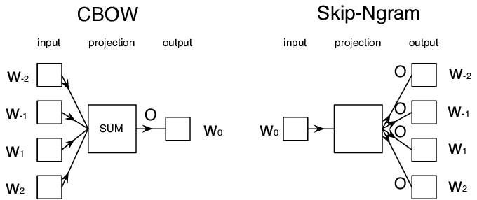

# Dimensionality Reduction

## 1. Introduction
When applying machine learning model in the pratical tasks, one of the first challenge that an engineer face is to construct a numerical structure that can represent the data and can be trainable. *For example, in natural language processing task, the challenge is convert the text data into numerical data.* However, in some case, not all data can be fit well to model. One of the reason is the enormous dimension of data, which increase the cost of training while reduce the performance of model when infer on test set (overfitting). 

In NLP task, the basic techiques to encode text are word count or Term Frequency - Inverse Document Frequency vectorization, which vector take one entry for each word in the vocabulary, make the dimension of vector extremely huge in small task.

**Dimensionality reduction** is the family of techniques used in Machine Learning to reduce the dimension of the feature vector, which aim to: 
- Reduce the overfitting when training on very high-dimension of feature vector.
- Reduce the cost for training the data.
- Increase the performance of the model.
- More suitable for many models and many devices.

The main difficulty in dimensionality reduction techniques is to manage the tradeoff between the underlying information of the feature datas and the dimension of it. In Assignment 2, we have implemeted two dimensionality reduction techniques, include: Principle Component Analysis, Word Embedding model. We will use those to compare the result of using feature vector inferred from thise technique with the TF-IDF vector that we have implemented in Assignment 1. 

## 2. Principle Component Analysis
**Principal component analysis**, or PCA, is a dimensionality reduction method that is often used to reduce the dimensionality of large data sets, by transforming a large set of variables into a smaller one that still contains most of the information in the large set.

The theretical foundation of PCA is the use of an eigendecomposition of the data's covariance matrix or via Singular Value Decomposition:
$$
    X_{norm} = U \cdot \Sigma \cdot V^T 
$$
Where:
- $N$: number of training samples.
- $D$: feature dimension of single sample.
- $X_{norm}$: normalization of $X$, $X$ has shape $N\times D$. From here, we simply use $X$ to indicate $X_{norm}$.
- $U$: $N\times N$ matrix.
- $V$: $D\times D$ matrix. $U$ and $V$ are orthogonal vector.

We can deduce that:
$$
    X^TX = V \Sigma^T \Sigma V^T = V \begin{pmatrix}
\sigma_1^2 & \cdots & 0 \\
\vdots & \ddots & \vdots \\
0 & \cdots & \sigma_d^2
\end{pmatrix} V^T
$$

In this formula, each column vector of $V$ is an eigenvector of covariance matrix $X^TX$ and each value $\sigma_i^2$ is eigenvalue of $X^TX$.

Each value of $\sigma_i^2$ or $\lambda_i$ is amount of variance of principle component $V_i$ (row $i^th$ of matrix $V$). When doing Singular Value Decomposition, it already sort row of $V$ by its correpoding $\lambda_i$.

PCA vector is then determine by: $$V = XW$$ Where $W = \Sigma \, V^T_{k}$. Where $V^T_{k}$ (Shape $D\times k$) contain first $k$ column vector of $V^T$ (already sort by corresponding eigenvalue). The amount of variance in the vector $V$ is determined by: $\frac{\sum^{k}_{i=1} \lambda_i}{\sum^{d}{j=1} \lambda_j}$.

### Code Implementation
In this assignment, we have implement `PCA` using numpy libary. For consistency between train and test, we train to get $W$ matrix (`top_k` components) by train data and simply apply to test set without reconstruct $W$ from test set.

In `pca_feature.py`, we construct two PCA functions to fit components: 
- `fit_by_fix_features`: construct $W$ using fix number of components.
- `fit_by_amount_of_variance`: construct $W$ using dynamic number of components, determine based on amount of variance user want to reduce.

Example of using:
```{python}
from pca_feature import PCA

# Train PCA() object
pca = PCA()
pca.fit_by_fix_features(X_train_feature, top_k=20)

# Convert feature vector
X_train_pca = pca.transform(X_train_feature)
X_test_pca = pca.transform(X_test_feature)
```

PCA feature's performance will be recorded in other 4 model tasks in this project and will be compared against the full rank vector.

### Discussion
The problem of PCA is the adjustion of number of components that should be kept, to balance between dimension size and the amount of variance. It has to be manually configured.

Another problem of PCA is that it depend on the original feature data matrix instead of directly represent the data feature.

To conclude, PCA is good dimension reductionality technique in term on cost for implement and the performance. It is also general for all tasks in which it directly reduce the size on the original feature data matrix. It can be combined with other dimensionality reduction techniques to provide better vector representation.
 
## 3. Word Embedding
We introduce another dimensionality reduction technique in this project, which is called Word Embedding. **Word Embedding**, or **Word2Vec**, is a technique used in specific task of NLP, to translate the text data into fixed-length numerical vectors representation. Different from TF-IDF or Word Count, dimension of Word2Vec vector do not depend strictly on the size of vocabulary. It also resolve the drawback of using TF-IDF or WordCount, which is the ability to capture the position and context of word in a single sentence.

Word2Vec focus on using the numerical vector to capture the context of the words. For example: two words **king** and **man** may have closer relationship that **man** and **car** in term on context that they can be applied. Word2Vec map those word with close relationship into those vector with small difference. 

Different from PCA, Word2Vec require the data to train, to learn the context between the words. The process of training Word2Vec typically include:
- Use Neural Network with Feedforward layer to train text data on any task. For example: CBOW use surrounding words to predict center word, Skip-Ngram use center word to predict surrounding words.
- The hidden layer, typically have very small dimension, that play intermediate role on forward and backward data between input and output layer, are embedding representation of word.

<div style="text-align: center;">
    
    <p><strong>Figure:</strong> CBOW and Skip-NGram architecture</p>
</div>

In our project, we use the pretrained word2vec model, FastText [^1], which is an open-source, lightweight library for efficient learning of word representations and text classification, developed by Facebook's AI Research (FAIR) team. FastText learn word vectors using both CBOW and Skip-NGram, but focus on n-gram embeddings, which are averaged to produce the final word vector. 

### Code Implementation

In our implementation, we use `fasttext-wiki-news-subwords-300` model, which is supported by `gensim`. Fastext-wiki have some which has some key features:
- Vector size is 300, vocabulary size $\sim$ 1 millions words and subwords.
- Work wells in low-resource or small-data scenarios.
- Embeds rare and misspelled words using subwords.
- Very fast and memory-efficient.
- Requires no deep model — good for classical ML tasks.

All of the download and implemented code are availabled in `word_embedding.py`. Here is the usage example:
```{python}
from word_embedding import WordEmbeddingVectors

model = WordEmbeddingVectors()

X_train_feature = model.vectorize(train_df['token'])
X_test_feature = model.vectorize(test_df['token'])
```

### Discussion
- Compare with TF-IDF or WordCount, word embedding provide very efficient vector in term of dimension and performance because it capture the context between words.
- Word2Vec can be combined with PCA to optimize the dimension of feature vector.

We will integrate Word2Vec representation into other models in this Assignment and try to evalute it's performance.


[^1]: Bojanowski, P., Grave, E., Joulin, A. and Mikolov, T., 2017. Enriching word vectors with subword information. Transactions of the association for computational linguistics, 5, pp.135-146.